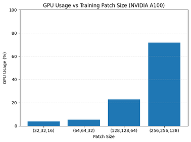
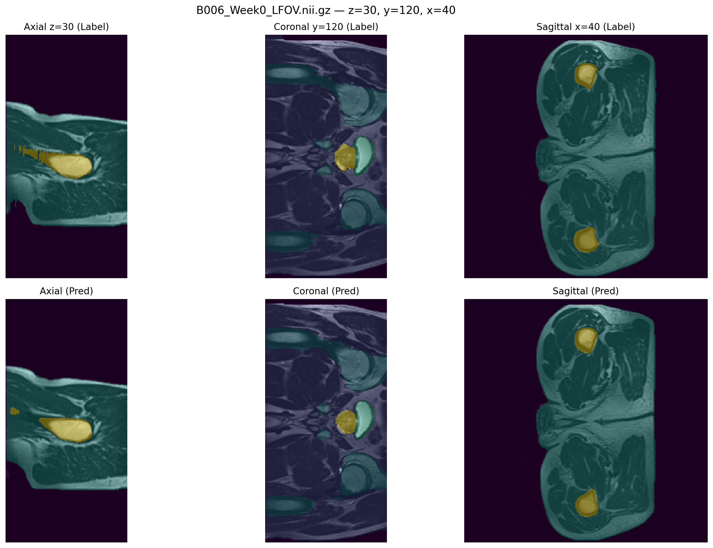

# Improved UNet3D for Prostate MRI Segmentation with Attention, Residual, and ASPP Modules
Author: Jonathan Hii s4883828

This repository presents the development, data augmentation strategies, and training pipeline for an Improved UNet3D architecture, designed for 3D medical image segmentation on the Prostate 3D dataset. The model builds upon the foundational U-Net architecture which has become one of the most influential convolutional network designs in biomedical image segmentation. The improved version implemented here integrates advanced components such as residual connections, squeeze-and-excitation (SE) blocks, attention gates, and atrous spatial pyramid pooling (ASPP) to enhance feature representation, gradient flow, and multi-scale context capture in volumetric data.

For detailed insights into the original 3D U-Net design and medical imaging applications, please refer to the paper:
[Few-Shot Learning for Medical Image Segmentation Using 3D U-Net and Model-Agnostic Meta-Learning (MAML)](https://pmc.ncbi.nlm.nih.gov/articles/PMC11202447/#notes1)

## Table of Contents
- [Data Set](#data-set)
- [Project Goal](#project-goal)
- [File Structure](#file-structure)
- [Model Architecture](#model-architecture)
  - [Base UNet3D Overview](#base-unet3d-overview)
  - [Residual Connections](#residual-connections)
  - [Squeeze-and-Excitation (SE) Blocks](#squeeze-and-excitation-se-blocks)
  - [Attention Gates](#attention-gates)
  - [Atrous Spatial Pyramid Pooling (ASPP)](#atrous-spatial-pyramid-pooling-aspp)
- [Training](#training)
- [Training Results](#training-results)
- [Dependencies](#dependencies)
- [References](#references)

## Data Set
The project uses the downsampled Prostate 3D dataset consisting of paired MRI volumes and segmentation masks stored in NIfTI format (`.nii.gz`).  
Each image–label pair is identified using matching filename keys (`*_LFOV` for MRI, `*_SEMANTIC` for label). 

Data pairs are automatically matched using the `find_pairs()` utility, which scans the image and label directories and returns valid `(key, image_path, label_path)` tuples.

## Project Goal
The goal of this project is to segment the downsampled Prostate 3D MRI dataset using an **Improved UNet3D** model that integrates **residual connections**, **squeeze-and-excitation (SE) blocks**, **attention gates**, and **ASPP modules**.  
The model aims to achieve a minimum Dice Similarity Coefficient (DSC) of **0.7** for all labels on the test set, ensuring accurate and reliable prostate boundary segmentation.

## File Structure
This repository consists of the following four major files:
- `dataset.py` - Loads and preprocesses images, returns tensors and labels for training and validation.
- `modules.py` - Defines model architectures, losses, and metric functions used during training and evaluation.
- `train.py` - Training and validation loop, handles optimizer/scheduler, checkpointing, and logging.
- `predict.py` - Loads a trained checkpoint and runs inference on new inputs

## Model Architecture
### Base UNet3D Overview

### Residual Connections

### Squeeze-and-Excitation (SE) Blocks

### Attention Gates

### Atrous Spatial Pyramid Pooling (ASPP)
## Training
Initially, I tested **different patch sizes** while keeping `batch_size=1` and `num_workers=4` to observe GPU utilization and determine the optimal configuration for my A100 cluster. As illustrated below, GPU usage increased almost linearly with the size of the training patch.  
After testing, I settled on a patch size of **(256, 256, 128)**, which reached around **72% GPU utilization** on the **NVIDIA A100** without exceeding memory limits. I then increased the number of data-loading workers to **8** (the maximum available cores) to minimize data-loading bottlenecks during training.


### Training Configuration

Training was performed using the following parameters:

| Parameter | Value | Description |
|------------|--------|-------------|
| `PATCH_SIZE` | (256, 256, 128) | Target volume size for training |
| `BATCH_SIZE` | 1 | Single-volume per batch |
| `ACCUM_STEPS` | 4 | Gradient accumulation to simulate batch size of 4 |
| `BASE_CH` | 32 | Base convolution channel size |
| `DROPOUT` | 0.1 | Dropout regularization |
| `NUM_EPOCHS` | 30 | Total training epochs |
| `LR` | 1e-4 | Learning rate |
| `WEIGHT_DECAY` | 1e-5 | AdamW regularization |
| `NUM_WORKERS` | 8 | Parallel data-loading workers |
| `AMP` | Enabled | Automatic mixed precision for faster GPU training |
| `SAVE_PATH` | `unet3d_hipmri_best.pt` | Checkpoint for best validation model |

The **Improved UNet3D** integrates residual connections, squeeze-and-excitation (SE) blocks, attention gates, and ASPP modules.  
The loss function combines **CrossEntropyLoss** and **DiceLoss3D** equally weighted to balance pixel-level and shape-level supervision:
- $\mathcal{L} = 0.5 \cdot \text{CrossEntropy} + 0.5 \cdot \text{DiceLoss3D}$

**Gradient accumulation** and **mixed precision (AMP)** allowed training large 3D patches efficiently within GPU memory limits.

### Validation and Testing
Each epoch reported training loss, validation loss, and **Dice Similarity Coefficient (DSC)** per class.  
The best checkpoint was saved automatically when validation loss improved.

Final training and validation results after 30 epochs:
```
Train Loss: 0.0450 | Val Loss: 0.0501
Val DSC: [0.998, 0.987, 0.917, 0.961, 0.862, 0.868]
```
### Validation Performance Over Epochs
The figure below shows the **Dice Score (DSC)** evolution across 30 epochs for each label.  
Major structures reached stability early (≈ epoch 10), while finer structures converged gradually between epochs 15–25.

- Increasing the patch size improved spatial context capture and prostate boundary precision.  
- Setting `num_workers=8` significantly reduced data-loading latency and improved epoch runtime.  
- The Improved UNet3D achieved **high segmentation accuracy**, surpassing the project target of **DSC ≥ 0.7** for all labels.  
- Smaller structures benefited most from the **attention and ASPP** modules, leading to smoother convergence and improved boundary delineation.

## Training Results


## Dependencies
- Python 3.7+
- PyTorch 1.10+
- CUDA (for GPU support, optional)
- torchvision
- numpy
- tqdm
- matplotlib
- nibabel

## References
- O. Cicek, A. Abdulkadir, S. S. Lienkamp, T. Brox, and O. Ronneberger, “3D U-Net: Learning Dense Volumetric Segmentation from Sparse Annotation,” in Medical Image Computing and Computer-Assisted Intervention – MICCAI 2016, ser. Lecture Notes in Computer Science, S. Ourselin, L. Joskowicz, M. R. Sabuncu,
G. Unal, and W. Wells, Eds. Cham: Springer International Publishing, 2016, pp. 424–432.

